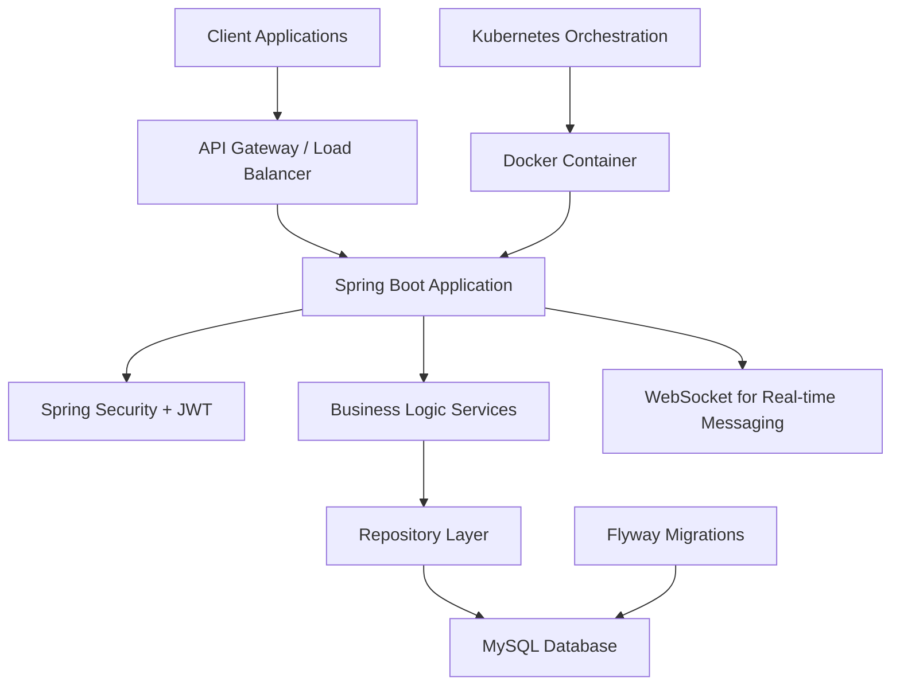
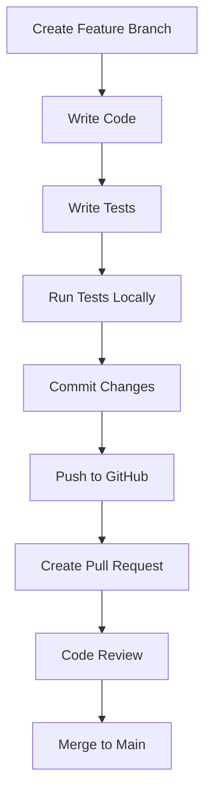
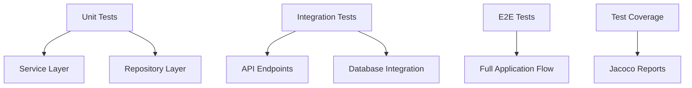
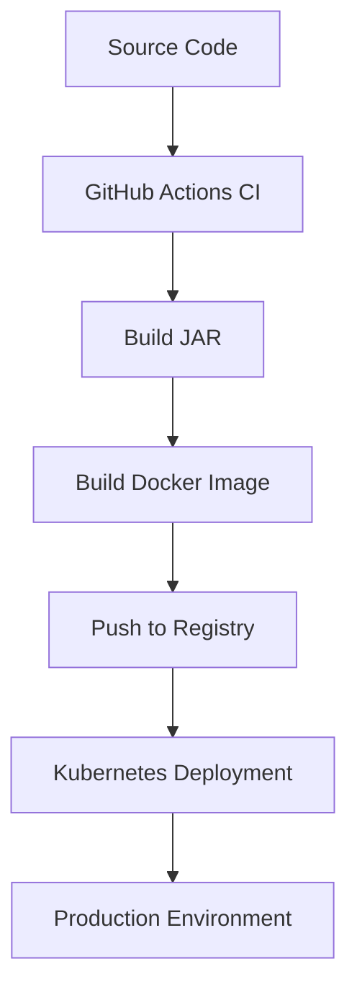
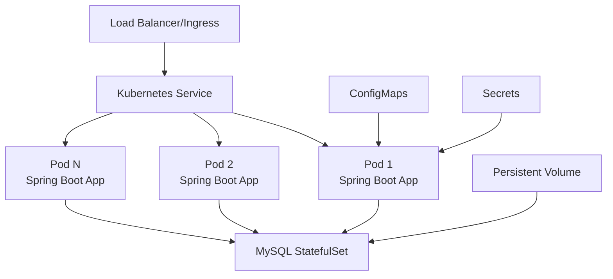
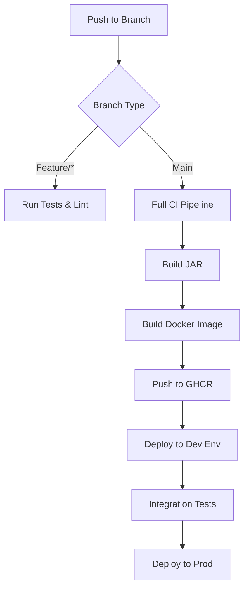
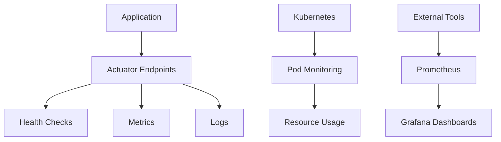

# AutoCare360 Backend Documentation

## Overview

AutoCare360 is a comprehensive backend service for an automotive care management system built with Spring Boot. It provides RESTful APIs for user management, appointment scheduling, notifications, and messaging. The system uses MySQL as the database with Flyway for schema migrations, and incorporates security features via Spring Security and JWT authentication.

The project emphasizes clean architecture, automated testing, containerization with Docker, orchestration with Kubernetes, and continuous integration/deployment through GitHub Actions.

## Architecture



### Key Components

- **Spring Boot Application**: Core business logic and REST APIs
- **MySQL Database**: Data persistence with Flyway migrations
- **Spring Security**: Authentication and authorization with JWT
- **WebSocket**: Real-time messaging capabilities
- **Docker**: Containerization for consistent deployment
- **Kubernetes**: Orchestration and scaling in production

## Development Environment Setup

### Prerequisites

- Java 21 (JDK)
- Maven 3.9+
- Docker and Docker Compose
- Git
- IDE (VS Code, IntelliJ IDEA, or Eclipse)

### Local Setup Steps

1. **Clone the Repository**
   ```bash
   git clone https://github.com/ColabDevelopers/dev-autocare360-backend.git
   cd dev-autocare360-backend
   ```

2. **Environment Configuration**
   ```bash
   cp .env.example .env
   # Edit .env with your local configuration
   ```

3. **Database Setup**
   ```bash
   docker-compose up mysql -d
   # Wait for MySQL to be ready
   ```

4. **Run the Application**
   ```bash
   mvn spring-boot:run
   ```

5. **Verify Setup**
   - API available at: `http://localhost:8080`
   - Health check: `http://localhost:8080/actuator/health`

### Development Workflow



## Building and Running

### Local Development

```bash
# Build the application
mvn clean compile

# Run tests
mvn test

# Package JAR
mvn clean package

# Run the JAR
java -jar target/autocare360-0.0.1-SNAPSHOT.jar
```

### Docker Development

```bash
# Build Docker image
docker build -t autocare360-backend:dev .

# Run with Docker Compose
docker-compose up --build
```

## Testing Strategy

The project follows a comprehensive testing approach:



### Running Tests

```bash
# Unit tests
mvn test

# Integration tests
mvn verify

# With coverage
mvn test jacoco:report
```

## Deployment to Production

### Docker Deployment



### Kubernetes Deployment

1. **Prerequisites**
   - Kubernetes cluster (k3s, minikube, or cloud provider)
   - kubectl configured

2. **Deploy to Kubernetes**
   ```bash
   # Apply base manifests
   kubectl apply -f deployment/kubernetes/base/

   # For specific environment (dev/prod)
   kubectl apply -k deployment/kubernetes/overlays/prod/
   ```

3. **Verify Deployment**
   ```bash
   kubectl get pods
   kubectl get services
   kubectl logs -f deployment/autocare360-backend
   ```

### Production Environment Architecture



## CI/CD Pipeline

The project uses GitHub Actions for automated CI/CD:



### Pipeline Stages

1. **Code Quality**: Linting, static analysis
2. **Testing**: Unit and integration tests
3. **Build**: JAR and Docker image creation
4. **Security**: Vulnerability scanning
5. **Deploy**: Automated deployment to environments

## API Documentation

### Authentication Endpoints

- `POST /api/auth/login` - User login
- `POST /api/auth/register` - User registration
- `POST /api/auth/refresh` - Token refresh

### Core API Endpoints

- `GET /api/users` - User management
- `GET /api/appointments` - Appointment scheduling
- `GET /api/notifications` - Notification system
- `GET /api/messages` - Messaging system

### WebSocket Endpoints

- `/ws/messages` - Real-time messaging

## Monitoring and Observability



## Security Considerations

- JWT-based authentication
- CORS configuration
- Input validation
- SQL injection prevention
- Secure secrets management
- HTTPS enforcement in production

## Troubleshooting

### Common Issues

1. **Database Connection Issues**
   - Ensure MySQL container is running
   - Check connection string in `application.properties`

2. **Port Conflicts**
   - Verify port 8080 is available
   - Use `netstat -an | find "8080"` on Windows

3. **Build Failures**
   - Clear Maven cache: `mvn clean`
   - Check Java version: `java -version`

### Logs and Debugging

```bash
# Application logs
docker-compose logs app

# Database logs
docker-compose logs mysql

# Kubernetes logs
kubectl logs -f deployment/autocare360-backend
```

## Contributing

1. Follow the development workflow
2. Write comprehensive tests
3. Update documentation
4. Follow conventional commit messages
5. Create pull requests for all changes

## Support

For issues and questions:
- Check existing GitHub issues
- Create new issue with detailed description
- Include logs and environment information

---

*This documentation is maintained alongside the codebase. Please update it when making architectural changes.*